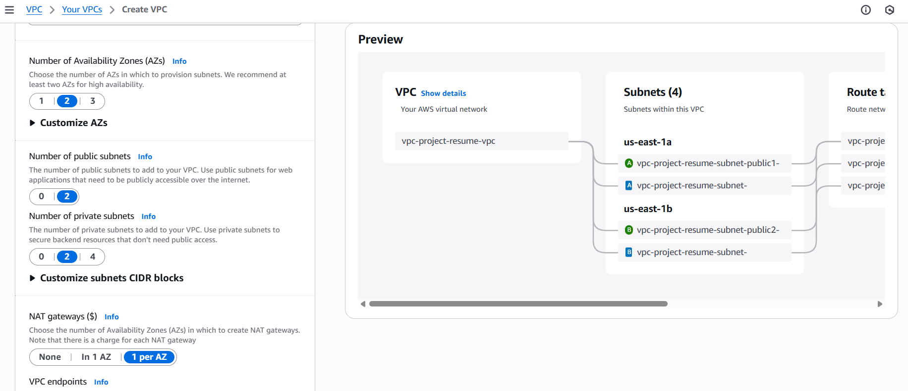
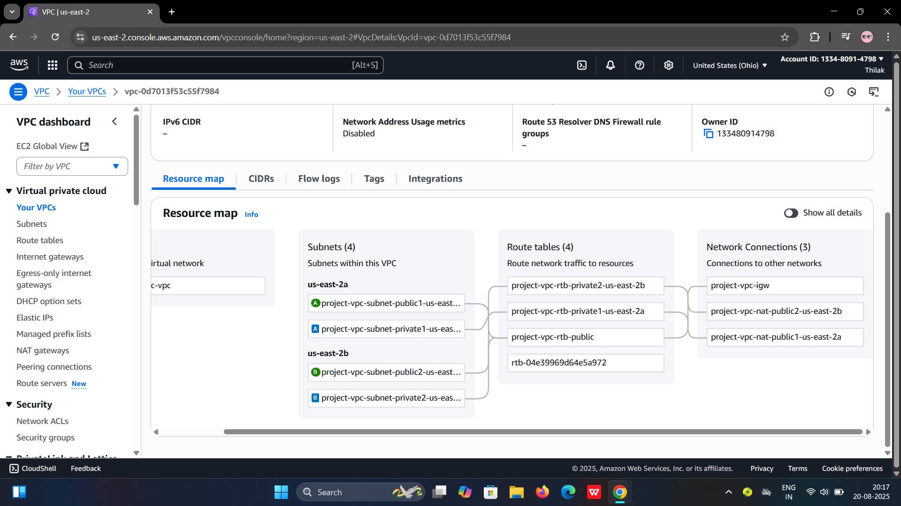
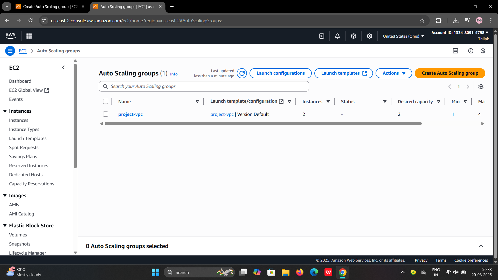
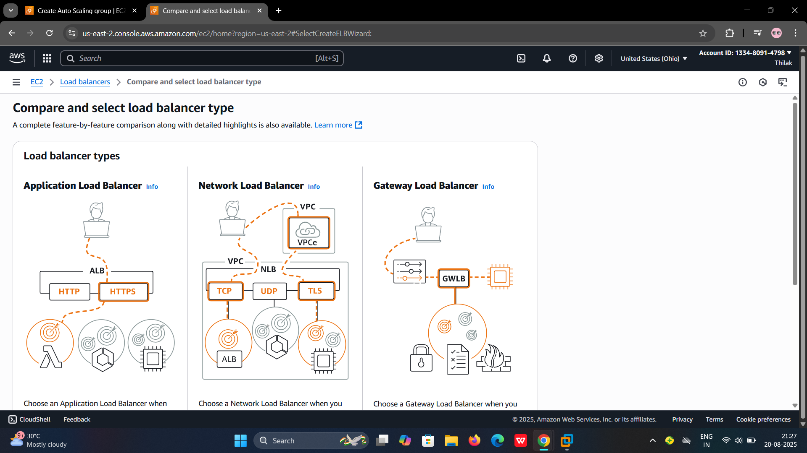
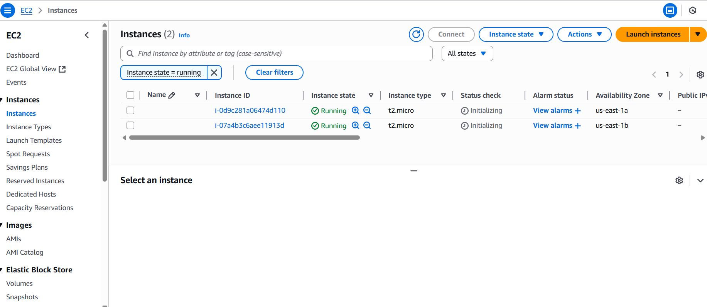
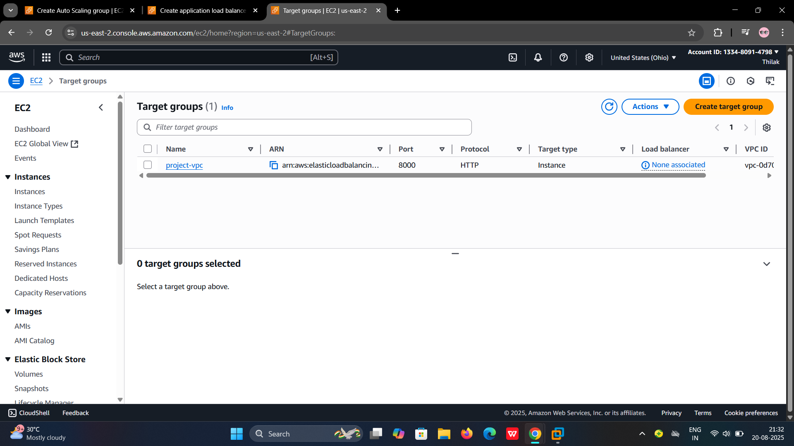
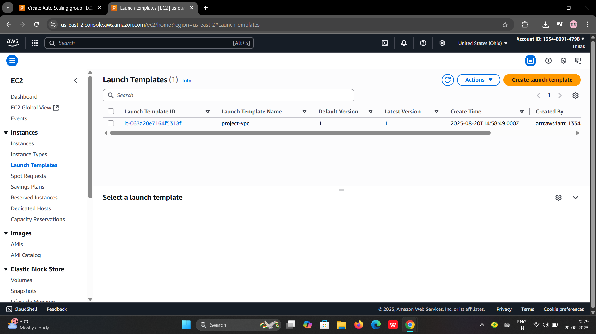

# aws-vpc-architecture-project
AWS VPC Architecture with Application Load Balancer, Auto Scaling, NAT Gateways, and Security Groups for a highly available infrastructure.
# AWS VPC Architecture

This repository contains an AWS VPC architecture diagram showcasing a highly available and secure setup.

## Architecture Diagram


## Overview
- **VPC** with public and private subnets  
- **Application Load Balancer** for traffic distribution  
- **Auto Scaling Group** for scalability  
- **NAT Gateways** for secure outbound traffic   
- **Security Groups** to control inbound/outbound rules

  # AWS VPC Architecture

This repository contains an AWS VPC architecture diagram showcasing a highly available and secure setup.

---

## 📌 Full Architecture Diagram


---

## 🏗️ Overview

### 1️⃣ VPC with Public and Private Subnets
  
The VPC is divided into **public and private subnets** across multiple availability zones to ensure redundancy and isolation of resources.

---

### 2️⃣ Application Load Balancer
  
The **Application Load Balancer (ALB)** distributes incoming traffic across multiple servers in different availability zones to ensure high availability and fault tolerance.

---

### 3️⃣ Auto Scaling Group
  
The **Auto Scaling Group (ASG)** automatically adds or removes servers based on traffic load, ensuring scalability and cost efficiency.

---
### Target Group
A **Target Group** is used by the **Application Load Balancer (ALB)** to route traffic to registered targets (like EC2 instances, IPs, or Lambda functions).  
It provides:  
- **Load balancing** – distributes traffic evenly across healthy instances.  
- **Health checks** – continuously monitors the health of targets to route requests only to healthy ones.  
- **Target types** – supports EC2 instances, IP addresses, or AWS Lambda.  



---

### Launch Template
A **Launch Template** defines the configuration for EC2 instances.  
It includes:  
- **AMI ID** – the operating system and software stack to use.  
- **Instance type** – defines the CPU, memory, and networking capacity.  
- **Key pair** – for SSH access.  
- **Security groups** – to control inbound and outbound traffic.  
- **User data** – for automated bootstrapping (like installing software on startup).  

Launch templates help ensure consistent configurations across instances and simplify scaling with Auto Scaling Groups.  


---
### 4️⃣ NAT Gateways
  
The **NAT Gateway** allows instances in private subnets to securely access the internet while preventing unsolicited inbound traffic.

---

### 6️⃣ Security Groups
  
**Security Groups** act as virtual firewalls, controlling inbound and outbound traffic at the instance level to ensure security.

---

## 🔧 How to Use
1. Clone this repository:
   ```bash
   git clone https://github.com/Thilak-2005/vpc-architecture.git
